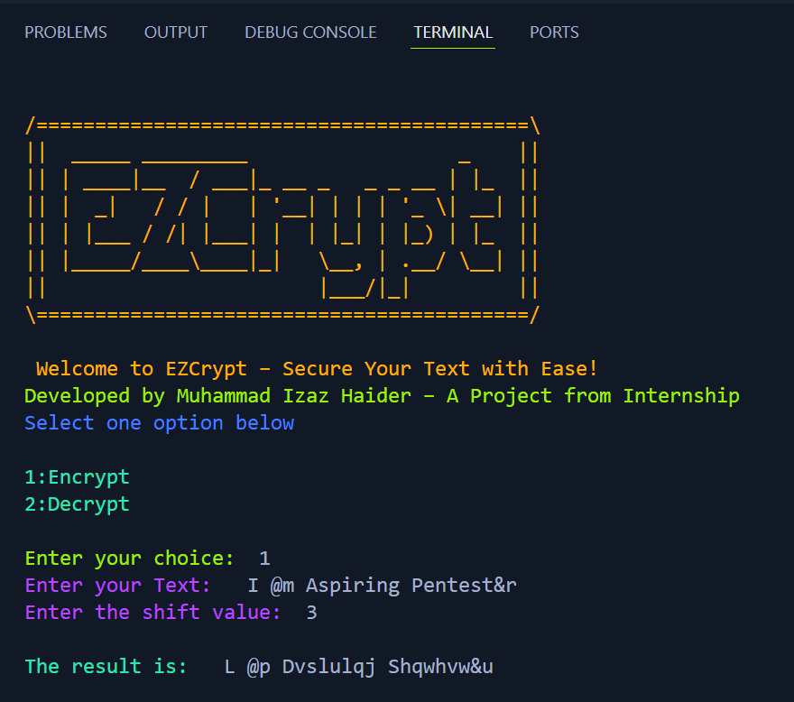
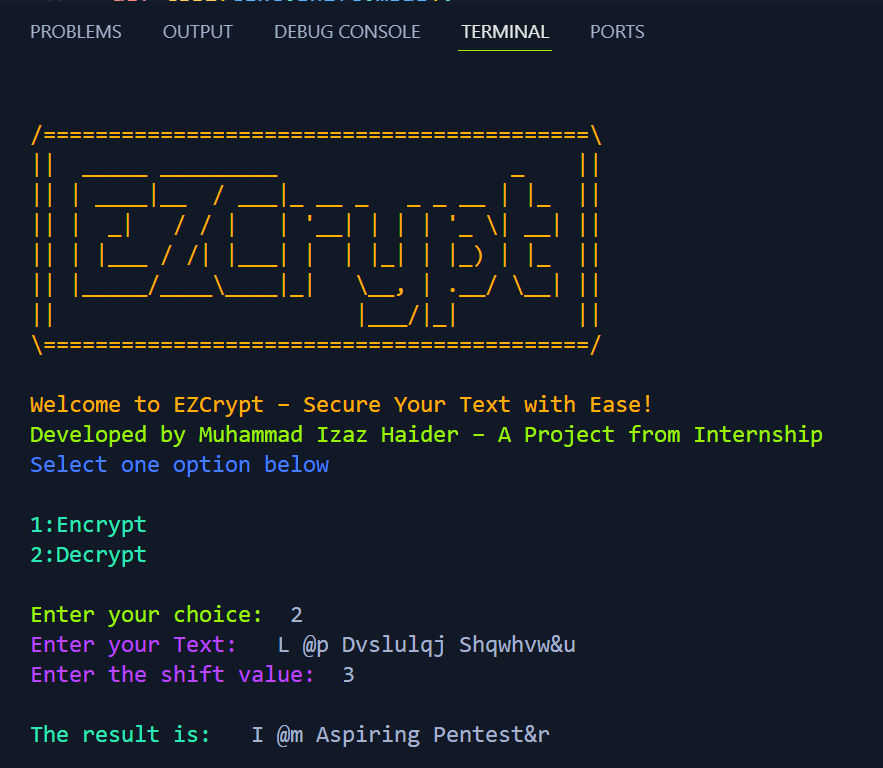
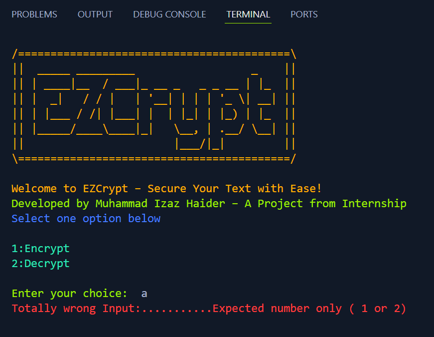

# EZCrypt - Secure Your Text with Ease! 🔐

### Developed by: Muhammad Izaz Haider

### Internship Project at: Prodigy InfoTech

## 📌 Overview

EZCrypt is a simple yet powerful encryption and decryption tool built using Python. It utilizes the  **Caesar Cipher Algorithm** , allowing users to securely encode and decode messages with ease. The project provides an interactive command-line interface with colorful output to enhance the user experience.

## 🛠 How EZCrypt Works

EZCrypt is based on the  **Caesar Cipher Algorithm** , a classical encryption technique where each letter in the text is shifted by a fixed number of positions in the alphabet.

* **Encryption:** Moves letters forward by a given shift value.
* **Decryption:** Moves letters backward by the same shift value to restore the original message.
* **Enhanced Efficiency:** Uses `shift % 26` to handle large shift values effectively.

## 🖥 Screenshots

## 📌 Features

* Encrypts text using a user-defined shift value
* Decrypts text back to its original form
* Handles both uppercase and lowercase letters
* Preserves special characters, spaces, and numbers
* Optimized shift handling with `<span>shift % 26</span>` for large values
* User-friendly interface with color-coded outputs
* Error handling for invalid inputs

## 📂 Project Structure

```bash
PRODIGY_CS_01-EZCrypt/
│── EZCrypt.py              # Main Python script
│── README.md               # Project documentation
│── screenshots/            # Folder containing example outputs
│   │── encrypt.png
│   │── decrypt.png
│   │── wrong_input.png
```

## 📌 **Encryption Process:**



## 🔐 **Decryption Process:**



## ❌ **Wrong Input Handling:**



## 🎯 Why I Built This Project

This project was developed during my internship at **Prodigy InfoTech** to apply cryptographic concepts in Python. It helped me gain hands-on experience with encryption techniques, improving my problem-solving and secure coding skills.

## 📚 What I Learned

* **Cipher Algorithms & Cryptography Basics**
* **Python String Manipulation & ASCII Character Handling**
* **Handling Large Shift Values Efficiently (`shift % 26`)**
* **Enhancing User Experience with Colored Terminal Outputs**
* **Debugging & Error Handling for Secure Input Processing**

## 🛠 Installation & Usage

### 🔹 Prerequisites

Make sure you have **Python 3.x** installed on your system.

### 🔹 Clone the Repository

```bash
 git clone https://github.com/mizazhaider-ceh/PRODIGY_CS_01-EZCrypt.git
 cd PRODIGY_CS_01-EZCrypt
```

### 🔹 Run the Program

#### On Windows

```bash
 python EZCrypt.py
 or
 python3 EZCrypt.py
```

#### On Linux or MacOs

###### First, grant execution permissions:

```bash
 chmod +x EZCrypt.py
```

###### Then execute the script:

```bash
 ./EZCrypt.py
 or
 python3 EZCrypt.py
```

### 🔹 Usage

1. Choose an option: `1 for Encryption` or `2 for Decryption`.
2. Enter the text you want to encrypt or decrypt.
3. Provide a shift value (a number between 1-25).
4. Get the encoded/decoded output instantly!

## Special Thanks

A huge thanks to **Prodigy InfoTech** for providing an incredible internship opportunity, allowing me to explore encryption techniques and refine my Python skills.

## 🏆 The Project Ends... But The Journey Begins!

If you like this project, consider giving it a ⭐ on GitHub!

## 📜 License

This project is open-source and available under the MIT [LICENSE](LICENSE).

### 📬 Connect with Me

[LinkedIn](https://www.linkedin.com/in/muhammad-izaz-haider-091639314/) | [GitHub](https://github.com/mizazhaider-ceh) | [Gmail](mizazhaiderceh@gmail.com)
